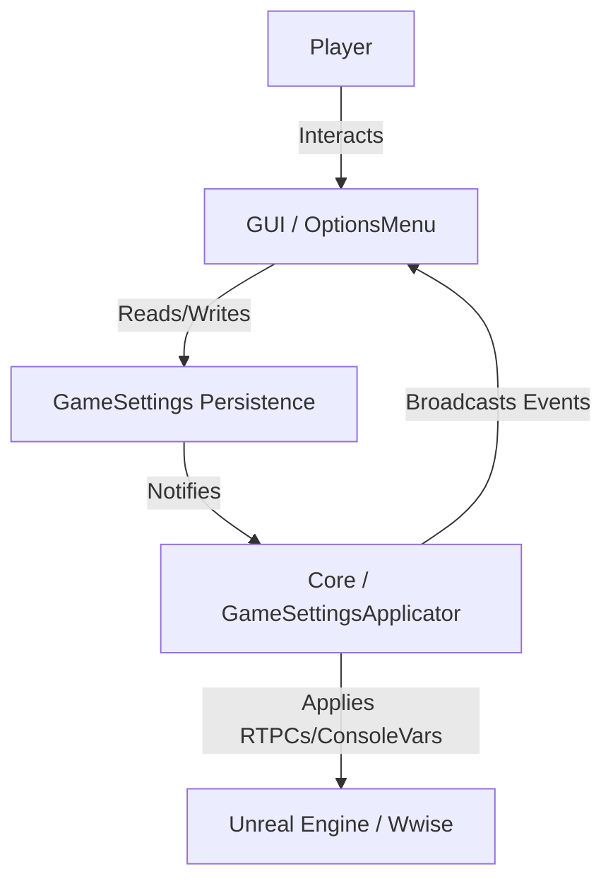

# 游戏设置架构 (Game Settings Architecture)

本文档提供了游戏设置系统的自上而下的架构分析，涵盖了用户界面 (GUI) 与核心逻辑 (Core Logic/Backend) 之间的交互。

## 1. 架构概览

设置系统遵循类似 **Model-View-Controller (MVC)** 的模式，将视觉表现与将设置应用到游戏引擎的逻辑分离开来。

*   **View (GUI):** 处理用户输入并显示当前状态。位于 `GUI/OptionsMenu/`。
*   **Controller/Logic (Core):** 管理设置的应用、平台特性以及与音频引擎的通信。位于 `Core/Settings/`。
*   **Data/Persistence:** 依赖于 `GameSettings` 系统（可能是基于 C++ 的，通过 AngelScript 访问），使用基于字符串的键（例如 `n"MasterVolume"`）来保存/加载值。

### 架构图

## 2. 数据流分析 (Data Flow Analysis)

### 2.1 初始化 (Initialization)
1.  **Startup:** `UGameSettingsApplicator` 初始化 (Singleton)。它加载保存的设置或应用特定于平台的默认值（例如，检查平台是否为 "Sage" 或检测 Audio Objects）。
2.  **Menu Open:** `UOptionsMenu` 被构造。它创建特定的页面（例如 `UAudioOptionsMenuPage`）。
3.  **Data Binding:** 页面订阅 `UGameSettingsApplicator` 事件（例如 `PostSpeakerConfigUpdates`），以对系统级更改（如拔出耳机）做出反应。

### 2.2 用户交互 (User Interaction - Changing a Setting)
1.  **Input:** 用户在 `UOptionWidget`（例如 Slider 或 Enum）中更改值。
2.  **Apply:** Widget 触发内部应用逻辑。
3.  **Persistence:** 该值使用特定键（例如 `MasterVolume`）保存到 `GameSettings` 系统。
4.  **Reaction:**
    *   `UGameSettingsApplicator` 检测到更改或被显式调用。
    *   它计算新状态（例如，将 `EHazeAudioDynamicRange` 映射到特定的 RTPC 值）。
    *   它执行 `AudioComponent::SetGlobalRTPC` 以立即更新音频引擎。
5.  **Feedback:** UI 可能会刷新以显示相关选项（例如，如果选择了 "Headphones"，则禁用 "Night Mode"）。

## 3. 目录摘要 (Directory Summaries)

| 目录 | 职责 | 关键类 |
| :--- | :--- | :--- |
| **`Core/Settings/`** | **逻辑与后端 (Logic & Backend)。** 定义设置如何影响游戏。处理 RTPC ID、每个平台的默认值（Console vs PC）以及将更改应用到引擎。 | `UGameSettingsApplicator` |
| **`GUI/OptionsMenu/`** | **表现与界面 (Presentation & UI)。** 定义特定的菜单页面、布局和可重用的 Widgets（Sliders, Buttons）。处理导航和焦点。 | `UOptionsMenu`, `UAudioOptionsMenuPage`, `UOptionWidget` |

---
*Generated by Gemini CLI Agent*